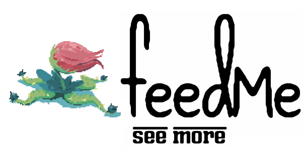

# Team FeedMe

**Members**

* Zachary Hardy
* Tengiz Vachnadze
* Benjamin Tibbetts
* Luke Leheny
* Josh McDuffie

# Project Overview

feedMe is a social RSS/media aggregator designed to allow users to create a feed from a variety of sources as well as the ability to see feeds of people they subscribe too. Users can customize their feeds with a filtering feature. feedMe incorporates aspects of many existing web applications, but it is completely fresh and unique. The user interface is attractive yet minimal in design, allowing the user to customize the appearance of their feed. The concept of feedME draws inspiration from a wide variety of web applications such as Tumblr, SoundCloud, Twitter, and the channel design of Youtube, but its innovation comes from the combination of a sophisticated, customizable aggregator with a social environment.

The social aspect of feedMe is what truly sets it apart from other aggregators. The user has the ability to subscribe to another user, giving them access to that user's feed. Additionally, the user is able to silence specific sources from the feeds of the people they subscribe to, displaying only the media that the user really wants. This allows the user to create and customize the content of their feeds as well as discovering the interests of their friends.

# Documents

###[Team Profile](./docs/profile.md)
###[Proposal](./docs/proposal/proposal.md)
###[Functional Spec](./docs/fspec/fspec.md)
###[Design Spec](./docs/dspec/dspec.md)
###[Glossary](./docs/README.md)

# Videos
https://drive.google.com/folderview?id=0B9udYezYC8O_cVJLREtsV3hZOGc&usp=sharing
