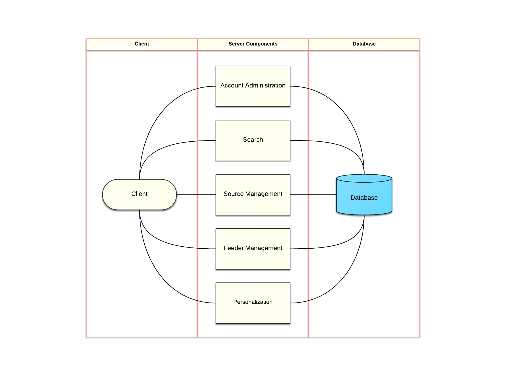

# Team feedMe Design Specification

## Overview:
>by Zack Hardy and Benjamin Tibbetts (11/12/2014)

feedMe is a social RSS/media aggregator designed to allow users to create a feed from a variety of sources as well as the ability to see feeds of people they subscribe too. Users can customize their feeds with a filtering feature. feedMe incorporates aspects of many existing web applications, but it is completely fresh and unique. The user interface is attractive yet minimal in design, allowing the user to customize the appearance of their feed. The concept of feedME draws inspiration from a wide variety of web applications such as Tumblr, SoundCloud, Twitter, and the channel design of Youtube, but its innovation comes from the combination of a sophisticated, customizable aggregator with a social environment.

The aggregator aspect of feedMe is similar to most typical text/news aggregators, with the addition of a variety of media.
The user interface of feedMe consists of different feeds that are customizable by the user. The user is able to choose what types of media their feeds display with checkboxes or the ability to separate a music feed from a news feed.

Aside from the additional types of media, the social aspect of feedMe is what truly sets it apart from other aggregators. The user has the ability to subscribe to another user, giving them access to that user's feed. Additionally, the user is able to silence specific sources from the feeds of the people they subscribe to, displaying only the media that the user really wants. This allows the user to create and customize the content of their feeds as well as discovering the interests of their friends.

**Disclaimer:** This specification document will be changed as our project progress. It is not, in any way, final. The images depicted in this document may not look anywhere close to the eventual GUI and may, indeed, differ drastically from the end result. Also, the user scenarios will describe what this web application will do, but not how.

## Changelog:
>by Benjamin Tibbetts (11/12/2014)

* Added body-parser
* Added ejs
* Added express
* Added feedparser
* Added less
* Added pg
* Added request
* Added serve favicon
* Added connect-flash
* Added express-session
* Added morgan
* ~~Added passport~~

## External Libraries:
>by Tengiz Vachnadze (11/14/2014) and Benjamin Tibbetts (12/05/2014)

It is necessary to utilize certain libraries to keep feedMe running smoothly.

*	Ajax - This library will mostly be used by the Loader component. This will ensure that the different feeds will load on the main page without the need to reload the whole page. This will make the application both simple and smooth to use.
*	body-parser - Node.js body parsing middleware.
*	connect-flash - Flash message middleware for Connect and Express.
*	cookie-parser - Cookie parsing middleware
*	ejs - Embedded Javascript templates
*	express - web framework for node
*	express-session - Session middleware for Express
*	farbtastic - This is a jQuery plug-in, which we are using for the colorwheel feature.
*	Feed Parser - This library will allow us to parse an RSS feed and will return all of the items in the feed as an array of Objects.
*	jQuery - In order to traverse and manipulate HTML documents easily we will need to use jQuery. This library will also make it easier for us to incorporate Ajax.
*	morgan - HTTP request logger middleware for node.js
*	node-postgres - This is a PostgreSQL client for node.js.
*	Request - Request will work in conjunction with Feed Parser to pull RSS feeds from websites.

## Architecture:
>by Josh McDuffie (11/15/2014)

## Component Description:

Component Name| Component Description |
--------------|-----------------------|
Account Administration|This component handles use-cases 1,2, and 3 reffered to in the functional specifications as Make Account, Login/logout, and Change Username/Password. Making an account will need to read from the database to check whether the username that the client enters is vacant. After successfully creating an account this component will need to write the username/password combination to the database and create a new user. During Login it only needs to read from the database and verify that the username/password combination exists and that the password is correct. It will also have to add the user to an array located in the database that shows which users are currently logged in. During Logout it needs to write to the database and remove the user that is loging out from the array. When changing username/password it both has to read and write to the database and update the username/password combination of that user. `by Tengiz Vachnadze (11/12/2014)`|
Source Managment|This component handles three use-cases: Addition/Removal of Sources, Creation/Deletion/Modification of Filter, and Silencing a Source. Adding a source will require modification of the database to include a new Source to User relation (which sources a user is subscribed to), and removing it will delete this relation. Creation of a filter will require a new relation in the database, linking a User to the different filters that they have on their account. Deletion of a filter will entail the removal of the particular relation, and modification will consist of adding or removing a certain Source from the filter. Silencing a source will be very similar to the Creation/Deletion/Modication of a Filter, except instead of removing the source from the filter permanently, there will be a checkbox to temporarily remove it from the displayed feeds. `by Benjamin Tibbetts (11/14/2014)`|
Feeder Managment|This component handles two use-cases: subscribing and unsubscribing from a feeder and stopping a source from being broadcast. Subscribing to a feeder will require a check to the database to make sure that the user is not already subscribed to this particular feeder. If the user is already subscribed, a notification will pop up and inform the user. If the user is not already subscribed, then we will create a new relation in the user/feeder table. Unsubscribing from a feeder will simply delete this relation. Stopping a source from being broadcast to all the other feeders will be relatively simple. The user will click on the "broadcast" section of the timeline and uncheck the box of the source that they no longer wish to broadcast. Once they click save, we will pass this information to the database and each relation between the user and the source will have a section for a boolean called "broadcast". If this is no longer being "broadcast", then it will save false.  `by Zack Hardy (11/15/2014)`|
Personalization|This component handles use case 9: Modify Color Theme. Using the color wheel will need to access the database to store the user's color preferences. It will first need to read from the database the user's current color settings, so that they can be displayed upon accessing the color wheel. When the user updates the settings, the personalization component will have to access the database to store the new settings. There will also be a "reset to default" option in the color settings, which will just replace the current setting in the database with the default value. `by Luke Leheny (11/14/2014)`|
Database|This component is responsible for storing all data needed by the system such as usernames, passwords, sources and feeders that users are subscribed to, and settings for users. The database will be implemented using PostgreSQL and data will be inserted to the database and retrieved from it through SQL queries sent to the database. `by Josh McDuffie (11/15/2014)`|
Search|This component is responsible for assisting a user in discovering new content. Through the use of a search bar the user can search for sources or feeders to subscribe to. The search component takes a user's search query and uses it to find relevant content or feeders from the database. The search component retrieves the relevant data from the database and returns the results to the user, displaying it on the search results page. `by Josh McDuffie (11/15/2014)`|
Loader|This component is responsible for displaying the data on the screen so that the user can read and interact with it. The loader is a part of the client side application that needs to access the database to retrieve the stories from subscribed sources, stories from subscribed feeders, filter settings, silenced sources, and user personalization settings. It takes this data in addition to HTML, CSS, and Javascript to construct the user's view. `by Luke Leheny (11/14/2014)`|

## Implementation Challenges:
During the implementation stage of the development of feedMe, our team faced a few challenges:
* Getting checkboxes from body of filter form
* Putting external html file into index without reloading page
* Algorithm for displaying feeds
