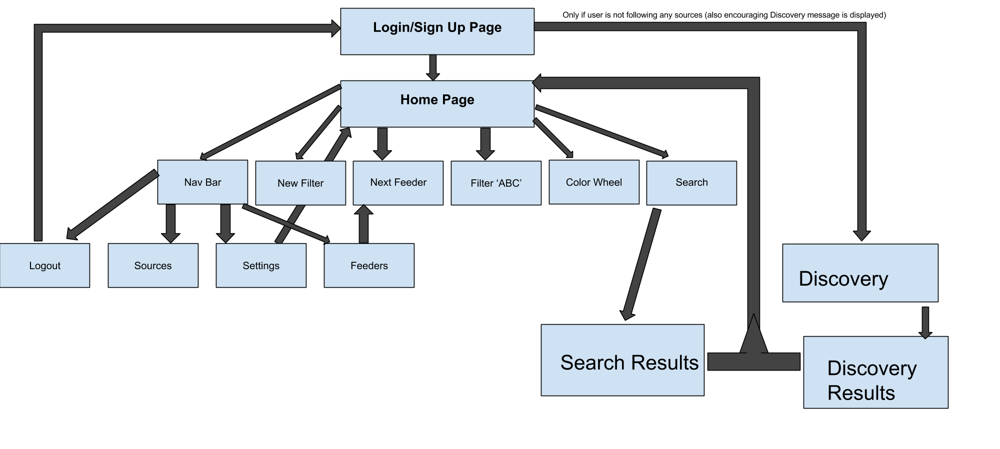
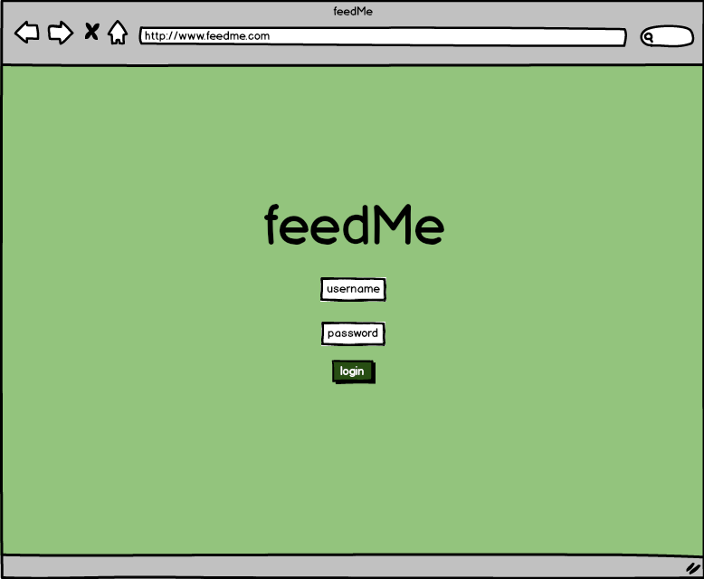
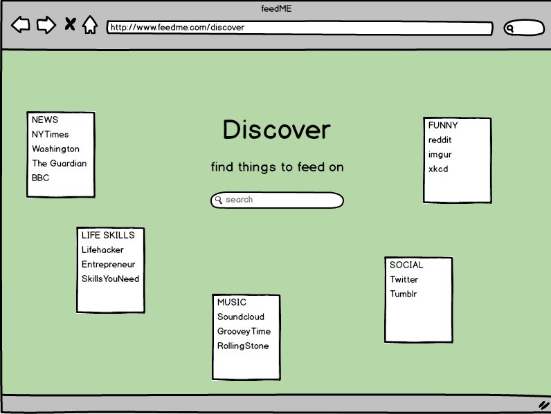
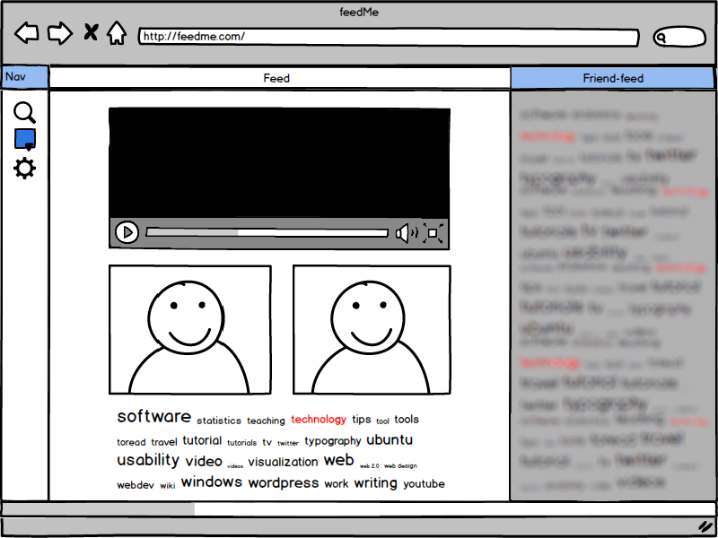
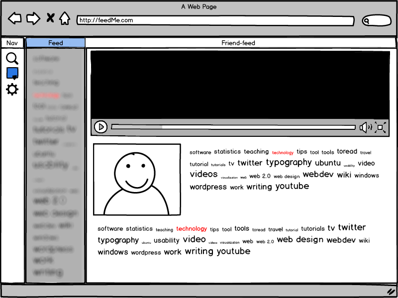
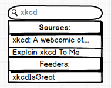
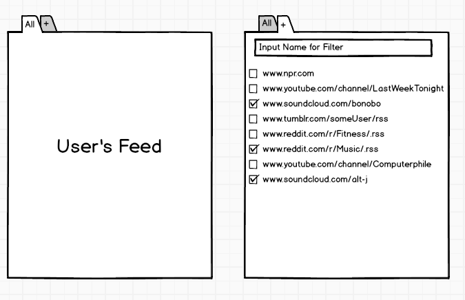

# Team feedMe Functional Specification
> (Title Page) by Luke Leheny (11/9/2014)

Created October 15, 2014

Last Modified November 14, 2014

Version 1.0

Zack Hardy, Tengiz Vachnadze, Benjamin Tibbetts, Luke Leheny, Josh McDuffie

## Team Organization:
> by Zack Hardy, Tengiz Vachnadze, Luke Leheny & Josh McDuffie (11/14/2014)

* **Josh McDuffie: Back-End Database Architect**
>Josh will be building the database and writing the JavaScript that accesses the database. The JavaScript accesses the database by sending SQL queries to retrieve the appropriate data which is then used to display content to the user.

* **Benjamin Tibbetts: Back-End JavaScript Developer**
>Ben will be helping Josh with the building of the database. He will also be writing the server-side Javascript, handling the requests from the client and sending responses.

* **Zack Hardy: Project Manager, Back-End Javascript Coordinator**
>Zack will be making sure that the frontend JavaScript and the backend JavaScript will mesh well together and will help to facilitate backend/frontend communication.

* **Tengiz Vachnadze: Front-End Javascript Developer**
>Tengiz will be working on client side JavaScript. He will be in charge of incorporating Javascript into the views of the Web App. He will also be implementing various requests/response handlers.

* **Luke Leheny: Front-End Style Editor, Documentor**
>Luke will be in charge of user interface and style. He will be working together with Tengiz to design the views. He will be doing so using HTML, CSS, and Javascript.

## Overview:
>by Ben Tibbetts and Zack Hardy (11/09/2014)

feedMe is a social RSS/media aggregator designed to allow users to create a feed of sources that they enjoy as well as looking at their friends’ feeds. It incorporates aspects of many existing web applications, but it is completely fresh and unique. The user interface is attractive yet minimal in design, allowing the user to customize the appearance of their feed. The concept of feedMe draws inspiration from a wide variety of web applications such as Tumblr, SoundCloud, Twitter, and the channel design of Youtube, but its innovation comes from the combination of a sophisticated aggregator with a social environment.

The aggregator aspect of feedMe is similar to any typical text/news aggregator except with the addition of alternative types of media.
The user interface of feedMe consists of different feeds that are customizable by the user. The user is able to choose what types of media their feeds display with checkboxes or the ability to separate a music feed from a news feed.

The social aspect of feedMe is what it’s all about. As mentioned earlier, the user has the ability to either add different parts of their friends’ feeds to theirs, or observe the feeds on their friends’ profiles.

**Disclaimer:** This specification document will be changed as our project progress. It is not, in anyway, final. The images depicted in this document may not look anywhere close to the eventual GUI and may, indeed, differ drastically from the end result. Also, the user scenarios will describe what this web application will do, but not how.

## Scenarios:

**Scenario #1**
> by Zack Hardy (10/21/2014)

Peter Gaines, a businessman from Texas, enjoys reading the news articles his friends post on Facebook everyday. However, he has found that as his business grows, he is finding it harder and harder to keep up with his friends. They are reading interesting articles and posting them on Facebook, but he is finding it difficult to wade through that stream of information. And as he reads more of his friends articles, he is finding his own interests falling to the way side, not being able to keep up with both his friends sources and browse the websites that he likes.
He is complaining about this to his wife and she suggests that he check out feedMe, a brand new social media website, to keep track of his different sources for news. He makes an account, verifies his email, and starts looking for his friends. He doesn't add all of his friends from Facebook, but starts looking for his friends who post articles that he is particularly interested in. After a couple of minutes, he has about twenty feeders. He then begins to add the websites that he used to browse everyday as sources to his own feed.
Now, Peter is able to keep up with his own friends articles. He doesn't have to wade through the mass of information anymore, able to now cherrypick and choose the specific friends who enjoy the same articles as he does. He is also able to look at the sources that he wants to keep up with again. He doesn't have to go to the website and browse for hours. Every article that he could be interested in is right there at his fingertips.

**Scenario #2**
> by Zack Hardy (10/21/2014)

Donna Moss, a secretary from Washington DC, loves her friend Josh's music and her friend Toby's webcomics. However, Josh has political views that she doesn't always agree with and Toby's music doesn't always line up with what she's interested in. She follow both of them on Facebook and gets updates on what they are doing, but she hates having to see these forms of content whose tastes don't match up with her own.
Her mom asked her over Thanksgiving if she had tried that new social media website feedMe. Interested, she starts an account. She has fun for a couple of hours adding sources to her main feed. She then adds her friend Josh and her friend Toby as feeders. She scrolls over to their page and creates a filter for both feeds. In the filter for Josh, she adds the music that she likes and on Toby's filter, she adds the webcomics.
Now, Donna has become unburdened by having to wade through the forms of content that she dislikes. She no longer has to bear the political ramblings of Josh or the poor music of Toby. She can, instead, simply view the forms of content that they post that she enjoys.

**Scenario #3**
> by Josh McDuffie (10/22/2014)

Rick Moranis always thought the coloring of objects in the world were a little off. When he was 35, and he discovered that this difficulty in telling the difference between colors was affecting his work, he learned he was colorblind. This fact made Rick depressed that he could not experience the beautifully designed websites that companies were creating. All this changed when his children suggested he check out feedMe. Using feedMe's color wheel Rick was able to quickly change the color scheme of the website until he found just the right colors that were appealing to him. Now, that pale green that would make most people sick is a splendid honey. Rick has finally found a site in which he can watch all of his favorite Youtube videos about shrink ray technology, with out a strange color scheme surrounding the page.

**Scenario #4**
> by Josh McDuffie (10/22/2014)

Kim Jong is a man who likes to get his way, but on sites like Reddit the content that is displayed is determined by what is popular with the masses. Using feedMe this is no longer an issue, Kim is able to subscribe to content that he enjoys seeing. No longer does Kim have to be burdened with stories of mass starvation and prison camps. Now, he can just see articles about the Chicago Bulls and keep up with what Dennis Rodman is doing. feedMe has allowed Kim to dictate what content he views and has given him the capability to create his own little Pyongyang on the web.  

**Scenario #5**
> by Luke Leheny (10/23/2014)

Bruce Willis, a young Brazilian boy, is very enthusiastic about his RSS feeds. He loves that he can subscribe to a website and get a list of recent articles to browse through whenever he has time. It's better than manually browsing the websites to find newly posted material. However, he wishes he could exchange RSS feeds with his friends, Bob Dylan and Bill Clinton, two Brazilian boys from down the street. He really wants to know where Bob gets his news and Bill gets his sports updates. He could ask Bob and Bill respectively where they get their news and sports information, but he's a busy guy. He turned to his aunt, Edna Willis, with his problem and she told him about feedMe. With feedMe, he can simply subscribe to both of them to see exactly what they are seeing when viewing RSS. That would save him the trouble of actually asking them, and would also provide realtime information on where each of them is getting their info.

**Scenario #6**
> by Luke Leheny (10/23/2014)

Hingle McCringleberry, a professional football player, likes to use websites like Youtube to check out stories (videos, in this case) about what other people are doing and thinking about. He finds that he knows a multitude of people, and favors the stories of some users over those of others. There is no easy way on these sites to solely view other users aside from typing their names into a box at the top of the screen or finding a story and clicking on the author. One day, he read an article about feedMe, a site he had not previously known about. With feedMe, Hingle is able to view one user's stories directly adjacent to his own stories just by scrolling to the right. By looking to the right of his own feed, he can see the feed of another user. Hingle is also happy because he can put his more favored users closer to his own feed for easier access than less favored users.

**Scenario #7**
> by Ben Tibbetts (10/26/2014)

Frederick Huckle, an elderly retired lawyer, felt a little out of touch with younger generations and the changing world around him. He was watching the news everyday, but he thought that there must be a better source for news and media. One day, his grandson Bobby told him about the website feedMe, an RSS aggregator, and described how it might solve his problem. Bobby told him a bunch of different news sources to follow and even said that Fred could follow Bobby to keeup up-to-date on all the local trends. Fred now feels more connected with the modern world and enjoys the other types of media that he can discover.

**Scenario #8**
> by Ben Tibbetts (10/26/2014)

Mary Lawrence, a young professional in Seattle, started to realize how often her friends were showing her new songs, videos on Youtube, and various blogs. They would send her emails or post links on her Facebook timeline. Mary is obsessed with efficient and she found this method of finding out about new content particularly inefficient. Just when she was thinking that there must be a better way to discover all of this content from her friends, she got an email from her friend Chris about feedMe, an RSS/multimedia aggregator where you can subscribe to your friends and see the sources that they follow. She convinced all of her friends to join feedMe, and now she can discover a variety of content from her friends as well as on her own. She no longer has to have this new media emailed or posted to her timeline, enabling her ultimate goal of being the most efficient woman in Seattle.

## Use Cases:

### Case 1: Make account
> by Tengiz Vachnadze (10/26/2014)

**Primary Actors:** User

**Precondition:** User doesn't have an account

**Assumptions:** User is logged out

**Main success scenario:**

1. User types in necessary information to create an account (username, email, password) on the login page.

	a. User clicks create

	b. User is automatically logged in.

**Alternate scenario:**

1. User types in necessary information to create an account (username, email, password) on the login page.

	a. If username is already taken the user gets prompted with “username taken” message.

### Case 2: Login/Logout
> by Tengiz Vachnadze (10/26/2014)

**Primary Actors:** User

**Precondition:** User has an account

**Assumptions:** User is logged out

**Main success scenario:**

1. User clicks login on the login page.

	a. User types in username and password and clicks login

	b. They get logged in

2. When user is logged in, they click logout.

	a. User is logged out.

**Alternate scenario:**

1. If username/password are entered incorrectly the user gets prompted with "incorrect username or password" message.

	a. User clicks Forgot password on login page.

	b. User types in his/her email.

	c. User gets his/her password emailed.

### Case 3: Change Username/Password
> by Tengiz Vachnadze (10/26/2014)

**Primary Actors:** User

**Precondition:**

**Assumptions:** User has an account

**Main success scenario:**

1. User clicks settings on the home page.

	a. User clicks change username/password in the settings menu.

	b. User types in their old and new username followed with their old and new password.

	c. Users username/password are set to the new value.

**Alternate scenario:**

1. If old username or password are entered incorrectly, the user gets prompted by "incorrect username or password" message.

### Case 4: Add/Remove source
> by Ben Tibbetts (10/15/2014)

**Primary Actors:** User, individual source

**Precondition:** User is logged in.

**Assumptions:** User has an account.

**Main success scenario:**

1. User clicks the "add source" button on a particular source.

	a. The source is added to their list of "sources".

	b. A message appears, telling the user that it was successful.

**Alternate scenario:**

1. User clicks the "remove source" button on a source that they follow.

	a. Source is removed from their list of "sources".

	b. User is alerted that the removal was successful.

**Exceptional scenarios:**

1. Source is removed from feedMe for some particular reason.

	a. Source must be removed from user's sources and they are informed that it doesn't exist.

### Case 5: Subscribing/Unsubscribing to a Feeder
> by Josh McDuffie (10/15/2014)

**Primary Actors:** User

**Precondition:** User is logged in

**Assumptions:**

**Trigger:** User enters a search query

**Main Success Scenario:**

1. User inputs the username of another user into the search field

2. User navigates to the feed of the Feeder they wish to unsubscribe from

	a. User clicks the X at the top right of the feed that they are currently looking at

	b. A confirmation box is displayed asking if the user really wants to unsubscribe

	c. User clicks yes

**Exceptional scenario: **

1. User that was searched for does not exist

**Additional Information:** When a user searches for a Feeder they are automatically subscribed to that user and their feed is displayed at the end of their list of feeds (Home Page) so step 1 is the success scenario for subscribing.

### Case 6: Silence a source from being broadcasted
> Zack Hardy (11/09/2014)

**Primary Actors:** User, individual feed

**Precondition:** User is subscribed to at least one source

**Assumptions:** User has an account, is logged in, and had navigated to their home page

**Main success scenario:**

1. User clicks "sources", under the homepage icon on the left hand navigation sidebar.

	a. User is presented with a list of sources from their individual feed with two check boxes, one for broadcast and one for subscribed.

	b. User unchecks the box that they do not want to broadcast this particular source to every Feeder that follows them.

	c. User clicks "Save" to save their preferences.

**Alternate scenario:**

1. User accidentally clicks the wrong source.

	a. User just unclicks the source.

2. User accidentally clicks "sources" under the homepage icon.

	a. User clicks "cancel" to return to the feeder.

3. User accidentally clicked the wrong source and saved the preference.

	a. User continues from Step 1 in main success scenario

	b. At step 3 from main success scenario, they check the box of the source that they want included.

	c. User clicks "save" to save their preference.

### Case 7: Silence a source from a feeder
> by Zack Hardy (11/09/2014)

**Primary Actors:** User, Feeder

**Precondition:** User is subscribed to at least one Feeder

**Assumptions:** User has an account, is logged in, and has navigated to a Feeder profile

**Main success scenario:**

1. User clicks "sources", under the homepage icon on the left hand navigation sidebar.

	a. User is presented with a list of sources from this particular feeder with check boxes, each source currently checked.

	b. User unchecks the box that they do not want to see brodcast on this particular persons feed.

	c. User clicks "Save" to save their preferences for this particular Feeder.

	d. Application returns to the Feeder, the sources unchecked above no longer appearing in the Feeder.

**Alternate scenario:**

1. User accidentally clicks the wrong source.

	a. User just unclicks the source.

2. User accidentally clicks "sources" under the homepage icon.

	b. User clicks "cancel" to return to the feeder.

3. User accidentally clicked the wrong source and saved the preference.

	a. User continues from Step 1 in main success scenario

	b. At step 3 from main success scenario, they check the box of the source that they want included.

	c. User clicks "save" to save their preference.

### Case 8: Create/Delete/Modify filter
> by Luke Leheny (10/15/2014)

**Primary Actors:** User

**Precondition:** User is logged in

**Assumptions:** User has an account

**Main success scenario:**

1. User clicks button to initiate filter creation.

	a. User checks off all sources desired for the filter in a dialog box.

	b. User enters name for filter in text box.

	c. User clicks save button to save the filter configuration.

2. User clicks tab for existing filter.

	a. User checks (unchecks) sources desired (undesired) for the filter in a dialog box.

	b. User clicks save button to save the filter configuration.

**Alternate scenario:**

1. User clicks delete filter button on existing filter tab.

	a. User clicks OK in confirmation dialog.

**Exceptional scenarios:**

1. New filter has no sources enabled: User will not be allowed to save the filter.

### Case 9: Modify color theme
> by Luke Leheny (10/15/2014)

**Primary Actors:** User

**Precondition:** User is logged in

**Assumptions:** User has an account

**Main success scenario:**

1. User hovers over navigation.

	a. User clicks color wheel.

	b. User chooses colors for foreground, background, etc. in the resulting dialog box.

	c. User clicks save button to save color settings.

## Non-Goals:
>Zack Hardy (11/09/2014)

* Communication/messaging between users.

* The ability to post original content.

* Offline access to content.

* No “total” social networking integration (Facebook, Myspace, etc.)

## Flowchart:
> by Josh McDuffie (10/15/2014)

## Screen-by-Screen:

### Login Page
> Ben Tibbetts (10/15/2014) and Zack Hardy (11/09/2014)

> When the user first navigates to www.feedMe.com, they will encounter the above screen. The website will automatically assume that the user does not have an account and will therefore ask them to provide one.

### Discovery Page
> Ben Tibbetts (10/15/2014) and Zack Hardy (11/09/2014)

> After the user signs in for the first time, he or she will be brought to the above screen, referred to in current development as the “Discovery” page. The page will contain many different types of content the user could subscribe to and a search bar that would allow the user to search for any source currently stored in the feedMe database. This database of sources will be added to by the users who provide new links to sources, which we then store within the database.

### Home Page
> by Luke Leheny (10/15/2014)

> After choosing a handful of different sources, the user will be brought back to the home page, which will now be populated with sources. In general, the homepage will look like this. On the left, will be a side-bar with four options: a navigation button with a couple of different options underneath it (including one to show every source the user is subscribed to and every Feeder the user is subscribed to), a magnifying glass indicating search functionality, a color picker which would allow the user to select the color scheme of the site, and a gear, which represents the settings for the site. In the center, is the feed for the user, which is made up of a number of different RSS feeds. On the right, you will see, blurred, the profile of another user (henceforth known as a “Feeder”) which you can click on at anytime. If you did click on that Feeder, you would be brought to a page that looked similar to the home page, but with a focus on another feeder:

### Feeder Page
> by Tengiz Vachnadze (10/15/2014)

> On the left, you see the sidebar again, but you also see the user’s homepage which, while similarly blurred out, you can click on at anytime to be brought to. You also have the same search functionality implemented here.

### Search Menu
> by Zack Hardy (11/09/2014)

> The search menu accessed from the navigation pane on the homepage and on the feeder page will show results for sources as well as other feeders. The results will likely be grouped in this fashion.

### Filter Creation
> by Josh McDuffie (11/09/2014)

> From a friend’s Feeder page or at a users home page, you can create a filter. A filter allows a user to see only a certain amount of sources by simply clicking on a tab. By default, the user sees every source they are subscribed to, but if the user wishes to see only “news” sources, for example, they will do so by creating a filter and switching over to that filter. The creation of a filter is depicted here.
