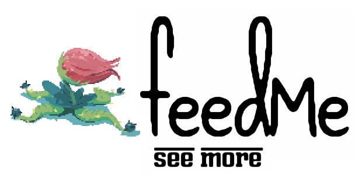

#Team feedMe 
**Company slogan**: See More 
**Company interest**: Music/mixed media content 
**Company logo**: 

###Members:

**Zack Hardy** (<zhardy@umass.edu> or <zhardy177@gmail.com>)

Previous CS Courses: 120 (Problem Solving Using the Internet), 121 (Introduction to Problem Solving with Computers), 191P (Introduction to Python), 187 (Programming with Data Structures), 220 (Programming Methodology), and a class at Smith college in Assembly using NASM. Also, I took CMPSCI 305: Social Issues in Computing.

Two previous college level courses: Digital Culture taught me a lot about what's going on in terms of the intersection of art and the Internet. History of Literary Critique forced me to think critically about all of the media that surrounds me on a day-to-day basis and think about the way it influences me.

Brief bio: I grew up in Massachusetts. I am a BDIC Major; my major is titled Writing in the Computer Sciences. I'm a senior. I've never written a full and working piece of software before, although I have designed a lot of websites and have had some experience with Android development. I work for both the BDIC program and the Writing Center on campus and host a weekly news show called "Tech Talk".

**Luke Leheny** (<lleheny@umass.edu>)

Previous CS courses: 121 (Introduction to Problem Solving with Computers), 187 (Programming with Data Structures), 220 (Programming Methodology), 230 (Systems Principles), 240 (Reasoning under Uncertainty), 250 (Computation), 311 (Algorithms), 377 (Operating Systems), 383 (Artificial Intelligence), and 305 (Social Issues in Computing)

Two courses taken outside of CS: Introduction to Logic, which has impacted the way I think, and Music Theory, which has helped me to be more creative.

Brief bio: I am from Providence, RI, currently a 5th year undergrad. I spend a lot of my time playing improvisational music. despite all those classes, I don't have that much experience coding. I know Java and C very well and Python fairly well. I have no experience in web programming whatsoever, but I am ready to learn. Recently, I found myself very interested in user interface style and design. Outside of academia, I am passionate about music and I spend a lot of my time composing and playing music.

**Josh McDuffie** (<jmcduffi@umass.edu>)

Previous CS courses: CS 121 (Introduction to Problem Solving with Computers), 187 (Programming with Data Structures), 220 (Programming Methodology), 230 (Systems Principles), 240 (Reasoning under Uncertainty), 250 (Computation), 305 (Social Issues in Computing) and Mount Holyoke's Algorithms class.

Two Courses outside of CS: Introduction to Political Economics, really exposed me to different economic theories and impacted how I view the interactions between organizations. World Politics, this class helped me understand how the history of colonialism and the structure of global economics has shaped countries that we refer to as third world.

Brief bio: I am a student at the University of Massachusetts Amherst and currently in my fifth year of undergrad working towards a BS in Computer Science with a focus in Artificial Intelligence. I was born and raised in Worcester, the heart of Massachusetts. I am most interested in back-end development and creating simplistic and efficient systems. Outside of academics I enjoy scuba diving and am working on becoming Advanced Scuba Certified.

**Ben Tibbetts** (<btibbett@umass.edu>)

Previous CS courses: 121, (Introduction to Problem Solving with Computers), 187 (Programming with Data Structures), 220 (Programming Methodology), and 250 (Computation)

Two Courses outside CS: Two Computational Linguistics classes that primarily use Python.

Brief bio: I am a Linguistics major and Computer Science minor, with a specific interest in the field of computational linguistics. I'm from the beautiful Midcoast region of the state of Maine. I enjoy writing in addition to writing code. My favorite language is Python and Java is a close second. I am new to web programming, but I'm learning fast and adapting to Javascript. In my spare time, I enjoy playing piano and binge-watching Netflix.

**Tengiz Vachnadze** (<tvachnad@umass.edu>)

Previous CS courses: 121 (Introduction to Problem Solving with Computers), 187 (Programming with Data Structures), 220 (Programming Methodology), 240 (Reasoning under Uncertainty), 250 (Computation).

Courses Outside CS: Relativity, Introduction to Microeconomics.

Brief bio: I'm a B.S in Computer Science, from Tbilisi, Georgia. I came to America for College. Most of my experience comes from what I've learned in the classes I listed above which is java and a little bit of c. I know the basics of html and not much beyond that, but I'm ready to learn.
